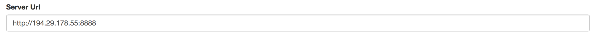
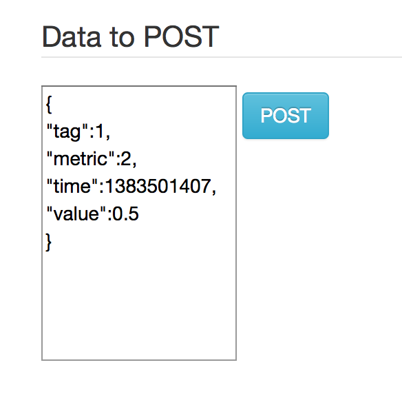
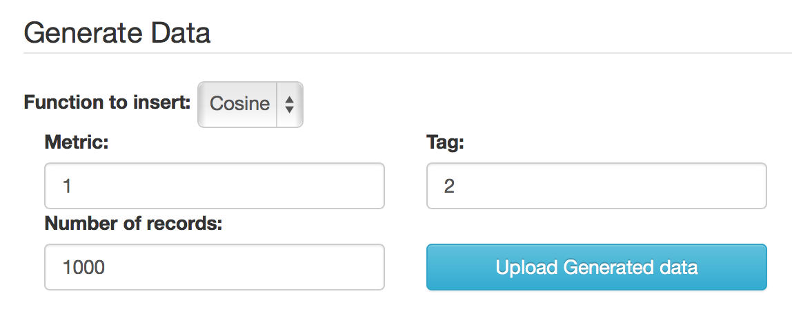

# Projekt Zespołowy
## Baza danych szeregów czasowych implementowana na klastrze obliczeniowym procesorów graficznych
## Dokumentacja użytkownika przeglądarkowego UI

### 0. Wybór serwera

### 1. Wkładanie pojedyńczych danych na serwer
Element z danym tagiem, metryką, czasem i wartością zostanie wstawiony do bazy danych. W tym celu zostanie wykonana operacja Insert.
 

### 2. Generowanie serii danych

Ta część interfejsu użytkownika pozwala na wygenerowanie ciągu elementów oraz dla każdego z nich wykonania operacji Insert.
Istnieje możliwość wyboru tagu oraz metryki z którą zostanie wygenerowany ciąg elementów
Ciąg elementów zostanie wygenerowany z czasami począwszy od czasu 0 do czasu równego liczbie elementów - 1
####Wybór ilości elementów do wstawienia

####Wybór rodzaju wartości do wygenerowania: sinus lub cosinus

###2. Zapytania typu select z opcjonalną agregacją wartości

Ta część interfejsu użytkownika pozwala na wysłanie zapytania o dane z opcjonalną agregacją tych danych
####Zapytanie

Postać zapytania zdefiniowana jest przez wystawione restowe api
Zapytanie powinno mieć następujący format:
/data/metric/{metrics}/tag/{tags}/time/{times}/aggregation/{aggr}
gdzie w miejsce:

  * {metrics} - podajemy listę metryk oddzielonych przecinkiem lub all jeśli chcemy pobrać dane z wszystkimi metrykami (meytyki są liczbami całkowitymi)
  * {tags} - podajemy listę tagów oddzielonych przecinkiem lub all jeśli chcemy pobrać dane z wszystkimi tagami (tagi są liczbami całkowitymi)
  * {times} - podajemy listę przedziałów czasowych jako pary {od}-{do} liczb całkowitych. Pary mogą być oddzielone przecinkiem. Np. 10-20,30-50 lub all
  * {aggr} - podajemy jeden sposób agregacji danych np. sum (suma) dostępne agregacje:
    
      * sum - suma
      * min - minimum
      * max - maksimum
      * avg - średnia
      * std - odchylenie standardowe
      * var - wariancja
      * int - całka (przy czym przy całce należy podać dokładnie jeden tag, metrykę i przedział czasowy)
  

####Wynik zapytania powinien wyświetlić się jako lista zwróconych rekordów

###2. Histogram

Ta część interfejsu użytkownika pozwala na wygenerowanie histogramu po czasie lub wartościach z wybranych elementów przechowywanych w bazie.
Istnieje możliwość wyboru tagów oraz metryk danych z których zostanie wygenerowany histogram
Wybieramy też przedział wartości oraz ilość kubełków histogramu
####Wybór rodzaju histogramu
Możemy wybrać histogram po wartościach lub po czasie

####Wybór właściwości histogramu

Ta część interfejsu użytkownika pozwala na dodanie 2 szeregów czasowych o wspólnej metryce.
Unikalnym identyfikatorem pojedyńczego jest para metryka-tag
Wynikiem dodania 2 szeregów czasowych jest inny szereg.
 Szereg wynikowy ma punkty czasowe zdefiniowane przez użytkownika za pomocą przedziału czasowego oraz liczby punktów
####Wybór szeregów
Podajemy metrykę oraz 2 tagi np. metryka: 1 tagi:1,2 zatem wybrane szeregi czasowe maja odpowiednio metryke i tag: (1,1) oraz (1,2)

####Użytkownik ustala czas od i do wynikowego szeregu czasowego oraz liczbę punktów w wynikowym szeregu (punkty równoodległe)
![]("sumSeriesResult.png"/>
####Przykładowy wynik
![]("sumSeriesExample.png"/>

### Autorzy
1. Jakub Dutkowski
2. Karol Dzitkowski
3. Tomasz Janiszewski

